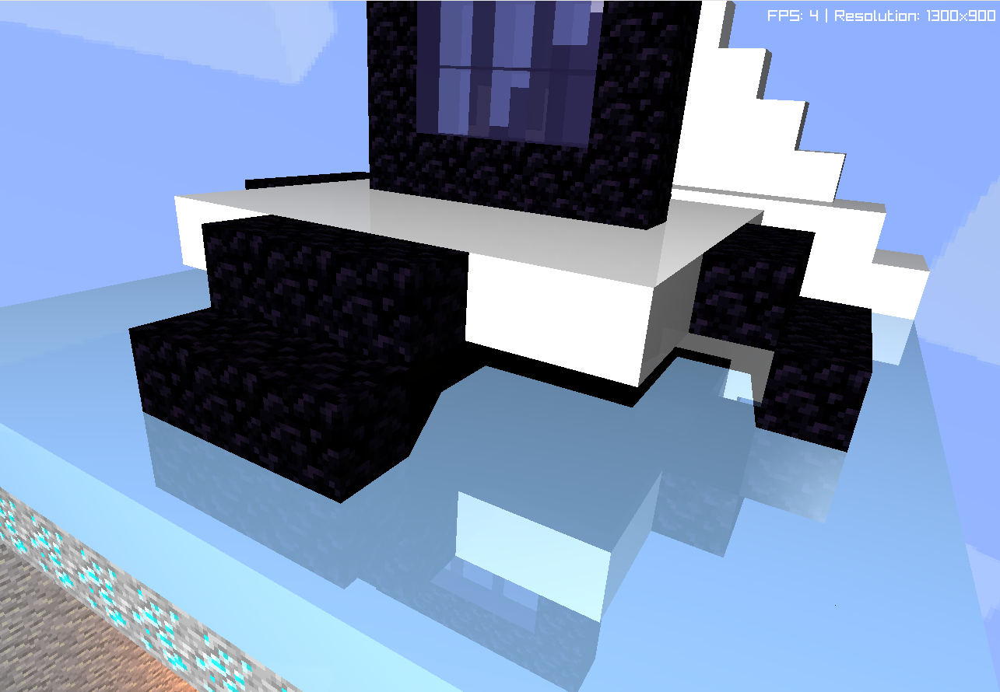

# Proyect2 3D Diorama


Este proyecto implementa un diorama 3D interactivo renderizado con **ray tracing en tiempo real** usando Rust. La cámara puede orbitar, acercarse, alejarse y desplazarse verticalmente mientras exploras un entorno inspirado en Minecraft construido con voxels.

## Galería




## Controles
- **Flechas izquierda/derecha**: órbita horizontal
- **Flechas arriba/abajo**: órbita vertical
- **W / S**: acercar / alejar (zoom)
- **Q / A**: mover la cámara verticalmente
- **1 – 5**: cambiar instantáneamente la calidad (Potato, Low, Medium, High, Ultra)

## Calidades de renderizado
| Modo   | Escala de resolución | Profundidad de rayos | Sombras | Refracción |
|--------|----------------------|----------------------|---------|------------|
| Potato | 0.15                 | 0                    | ✗       | ✗          |
| Low    | 0.33                 | 1                    | Parcial | ✗          |
| Medium | 0.50                 | 1                    | ✓       | ✗          |
| High   | 0.75                 | 2                    | ✓       | ✗          |
| Ultra  | 1.00                 | 4                    | ✓       | ✓          |

*Para cambiar de modo recomiendo dejar presionado y esperar un poco, para moverse con la camara usar calidad potato, luego para ver todos los efectos dejar apachado el 5 hasta que pase a calidad ultra (perdon si se tarda un poco :c, si se les traba cierren el programa y vuelvanlo a abrir, que con cpu esta complicado jajaja)*

## Materiales principales
| Material        | Textura                     | Albedo              | Specular | Reflectividad | Transparencia | Notas |
|-----------------|-----------------------------|---------------------|----------|---------------|---------------|-------|
| Madera (`log`)  | `assets/log.png`            | `[0.9, 0.1, 0.0, 0.0]`  | 8.0      | 0.0           | 0.0           | Estructuras de la casa |
| Césped (`grass`)| `assets/grass.png`          | `[0.9, 0.1, 0.0, 0.0]`  | 10.0     | 0.0           | 0.0           | Terreno exterior |
| Lava (`lava`)   | `assets/lava.png`           | `[1.0, 0.0, 0.0, 0.0]`  | 5.0      | 0.0           | 0.0           | Material emisivo con luz propia |
| Portal (`portal`)| — (color sólido)           | `[0.25, 0.2, 0.15, 0.55]`| 80.0     | 0.15          | 0.55          | Superficie con refracción y reflejos |
| Agua (`water`)  | — (color sólido)            | `[0.35, 0.18, 0.12, 0.55]`| 70.0     | 0.12          | 0.55          | Transparencia y refracción en Ultra |
| Hielo (`ice`)   | — (color sólido)            | `[0.85, 0.1, 0.25, 0.0]`  | 50.0     | 0.25          | 0.0           | Bloques con reflejos suaves y aspecto helado |
| Diamante (`diamond`)| `assets/diamond.png`    | `[1.1, 0.55, 0.0, 0.0]` | 10.0     | 0.0           | 0.0           | Refuerza el efecto cristalino |
| Obsidiana (`obs`)| `assets/obs.png`           | `[0.3, 0.4, 0.0, 0.0]`  | 120.0    | 0.0           | 0.0           | Marco del portal |
| Rostro (`face`) | `assets/face.png`           | `[1.35, 0.12, 0.0, 0.0]`| 8.0      | 0.0           | 0.0           | Efecto de luminosidad con albedo |


## Características destacadas
- Cámara orbital con zoom y desplazamiento vertical.
- Cambio de calidad instantáneo con framebuffers precalculados.
- Iluminación mixta (luz principal + fuentes emisivas como lava y portal).
- Skybox basada en la textura `assets/sky.png`.
- Refracción y reflexión configurables por material (activadas en calidad Ultra).
- Gestión de texturas en CPU/GPU con `TextureManager`.

## 🧰 Librerías y dependencias
- [`raylib`](https://www.raylib.com/) + [`raylib-rs`](https://github.com/deltaphc/raylib-rs): ventana, manejo de entradas y textura.
- [`rayon`](https://crates.io/crates/rayon): paralelización del cálculo de rayos.
- [`hashbrown`/`std::collections::HashMap`]: caché de framebuffers y texturas.
- [`std::sync::atomic`](https://doc.rust-lang.org/std/sync/atomic/): telemetría ligera por píxel.

Consulta `Cargo.toml` para ver la lista completa de dependencias y versiones.

## 🛠️ Cómo compilar y ejecutar
```bash
cargo run --release
```

La aplicación se abre en una ventana 1300×900, lista para explorar el diorama.

## 📂 Estructura básica del proyecto
```
src/
 ├── main.rs          # Bucle principal, materiales y montaje de la escena
 ├── camera.rs        # Utilidades para orbitar y mover la cámara
 ├── cube.rs          # Representación de cubos y colisiones
 ├── framebuffer.rs   # Framebuffer personalizado para renderizado
 ├── light.rs         # Fuente de luz principal
 ├── material.rs      # Definición de materiales y utilidades
 ├── textures.rs      # Carga de texturas en CPU/GPU
 └── structures/      # Generadores de estructuras del diorama (casa, portal, etc.)
assets/
 ├── sky.png          # Skybox
 ├── lava.png         # Texturas adicionales...
```
